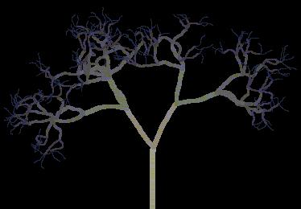

<div align="center">

## A Really Cool Random Tree Branch Generator \- With color fade and everything\!\!\!


</div>

### Description

~~~This is a really cool program that I made after reading a good book on Visual Basic Graphics Programming. It randomly creates tree branches as if they grew there on there own. They curve and stuff, and it's really cool. This is between Beginner and Intermediate Level stuff, so please rate nicely - :-D
 
### More Info
 


<span>             |<span>
---                |---
**Submitted On**   |
**By**             |[Jason Ryczek](https://github.com/Planet-Source-Code/PSCIndex/blob/master/ByAuthor/jason-ryczek.md)
**Level**          |Beginner
**User Rating**    |4.8 (57 globes from 12 users)
**Compatibility**  |VB 6\.0
**Category**       |[Graphics](https://github.com/Planet-Source-Code/PSCIndex/blob/master/ByCategory/graphics__1-46.md)
**World**          |[Visual Basic](https://github.com/Planet-Source-Code/PSCIndex/blob/master/ByWorld/visual-basic.md)
**Archive File**   |[](https://github.com/Planet-Source-Code/jason-ryczek-a-really-cool-random-tree-branch-generator-with-color-fade-and-everything__1-24312/archive/master.zip)


### Source Code

```
' This was made by Jason Ryczek
Option Explicit
Private Const PI = 3.14159
Private Sub Form_Load()
Me.BackColor = vbBlack
Randomize Timer
End Sub
Private Sub Form_MouseDown(Button As Integer, Shift As Integer, X As Single, Y As Single)
Dim Bend As Single
Dim Depth As Integer
Dim Thickness As Integer
Dim Length As Single
Dim RND_Scale As Single
Dim DTheta As Single
Dim RND_DTheta As Single
Dim Max_Branches As Integer
' t = temp for redraw with same values
Dim tBend As Single
Dim tDepth As Integer
Dim tThickness As Integer
Dim tLength As Single
Dim tRND_Scale As Single
Dim tDTheta As Single
Dim tRND_DTheta As Single
Dim tMax_Branches As Integer
Const Length_Scale = 0.75
Me.Cls
DoEvents
' Get Values
Depth = CInt(InputBox("Enter Depth:", "Depth...", "5"))
DTheta = CSng(InputBox("Ender DTHETA:", "DTHETA...", "36")) * PI / 180#
RND_Scale = (Round(3 * Rnd, 1) / 10)
RND_DTheta = (InputBox("Enter Number For Random DTHETA:", "Random DTHETA", "20")) * PI / 180#
Max_Branches = CInt(InputBox("Enter The Max Amount Of Branches:", "Max Branches", "3"))
Bend = PI / 90
Length = (Me.ScaleHeight - 10) / ((1 - Length_Scale ^ (Depth + 1)) / (1 - Length_Scale))
Thickness = Depth
' Draw Tree
DrawBranch Bend, Thickness, Depth, Me.ScaleWidth \ 2, Me.ScaleHeight - 5, Length, Length_Scale, RND_Scale, -PI / 2, DTheta, RND_DTheta, Max_Branches
End Sub
Private Sub DrawBranch(ByVal Bend As Single, ByVal Thickness As Single, ByVal Depth As Integer, ByVal X As Single, ByVal Y As Single, ByVal Length As Single, ByVal Length_Scale As Single, ByVal RND_Scale As Single, ByVal theta As Single, ByVal DTheta As Single, ByVal RND_DTheta As Single, ByVal Max_Branches As Integer)
Dim x1 As Integer, y1 As Integer, x2 As Integer, y2 As Integer
Dim Status As Integer
Dim Num_Bends As Integer
Dim Num_Branches As Integer
Dim i As Integer
Dim New_Length As Integer
Dim New_Theta As Single
Dim New_Bend As Single
Dim DT As Single
Dim T As Single
Const DistancePerBend = 5#
Const BendFactor = 2#
Const MaxBend = PI / 6
' Draw Bending Branches
Num_Bends = Length / DistancePerBend
T = theta
x1 = X
y1 = Y
For i = 1 To Num_Bends
  x2 = x1 + DistancePerBend * Cos(T)
  y2 = y1 + DistancePerBend * Sin(T)
  ' Thickness of branches
  Me.DrawWidth = Thickness 'Depth
  ' Draw Lines
  Me.Line (x1, y1)-(x2, y2), RGB((Depth + 1) * 20, (Depth + 1) * 20, (Depth + 1) * 10 + 100 * Rnd)
  T = T + Bend * (Rnd - 0.5)
  x1 = x2
  y1 = y2
Next i
' If depth > 1, draw the attached branches.
If Depth > 1 Then
  Num_Branches = Int((Max_Branches - 1) * Rnd + 2)
  DT = 2 * DTheta / (Num_Branches - 1)
  T = theta - DTheta
  For i = 1 To Num_Branches
    New_Length = Length * (Length_Scale + RND_Scale * (Rnd - 0.5))
    New_Theta = T + RND_DTheta * (Rnd - 0.5)
    T = T + DT
    If Bend > 0 Then
      New_Bend = Bend * BendFactor
      If New_Bend > MaxBend Then New_Bend = MaxBend
    Else
      New_Bend = Bend
    End If
    DrawBranch New_Bend, Thickness - 1, Depth - 1, x1, y1, New_Length, Length_Scale, RND_Scale, New_Theta, DTheta, RND_DTheta, Max_Branches
  Next i
End If
End Sub
```

